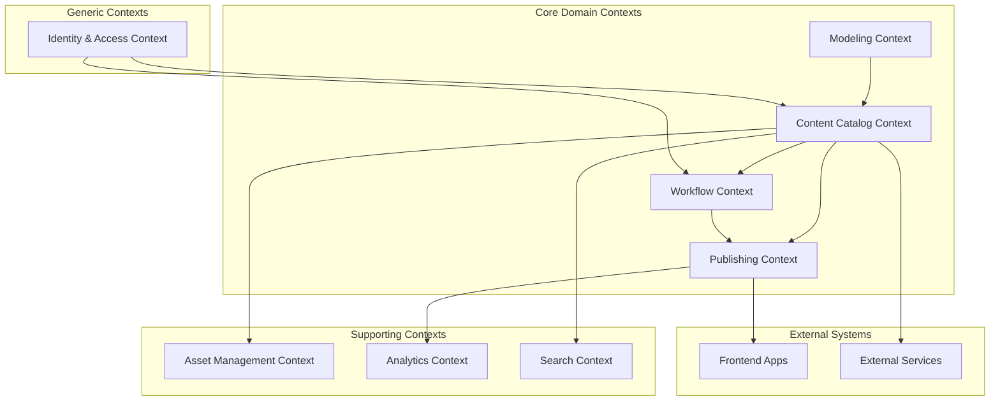
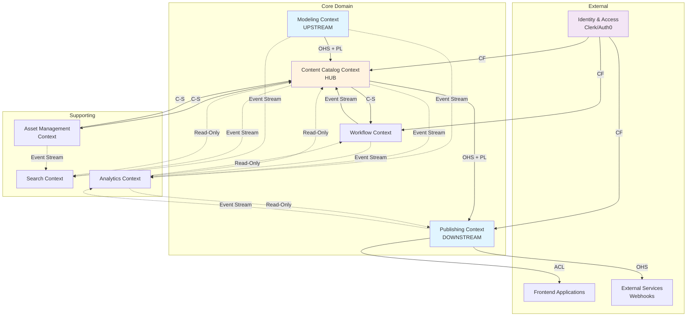

# Analiza Strategiczna DDD - 10x-CMS

> **Dokument:** Strategic Domain-Driven Design Analysis  
> **Data utworzenia:** 4 listopada 2025  
> **Bazuje na:** domain-analysis.md  
> **Cel:** Klasyfikacja subdomen, identyfikacja Bounded Contexts i mapowanie relacji

---

## Spis treści

1. [Klasyfikacja Subdomen](#1-klasyfikacja-subdomen)
2. [Bounded Contexts](#2-bounded-contexts)
3. [Context Mapping](#3-context-mapping)
4. [Integration Patterns](#4-integration-patterns)
5. [Rekomendacje Strategiczne](#5-rekomendacje-strategiczne)

---

## 1. Klasyfikacja Subdomen

### 1.1. Przegląd metodologii

Subdomeny klasyfikujemy według wpływu na przewagę konkurencyjną:

- **Core Domain** - Unikalna wartość biznesowa, przewaga konkurencyjna
- **Supporting Subdomain** - Niezbędne wsparcie, budowane wewnętrznie
- **Generic Subdomain** - Rozwiązania commodity, kandydaci do outsourcingu

### 1.2. Zidentyfikowane Subdomeny

| # | Subdomena | Klasyfikacja | Złożoność | Zmienność | Priorytet |
|---|-----------|--------------|-----------|-----------|-----------|
| 1 | Content Lifecycle Management | **CORE** | High | Medium | P0 |
| 2 | Content Modeling & Schema | **CORE** | High | High | P0 |
| 3 | Multi-Channel Publishing | **CORE** | High | High | P1 |
| 4 | Developer Experience (DX) | **CORE** | High | Medium | P0 |
| 5 | Workflow & Approval Engine | **SUPPORTING** | Medium | High | P1 |
| 6 | Asset Management (DAM) | **SUPPORTING** | Medium | Low | P1 |
| 7 | Search & Discovery | **SUPPORTING** | Medium | Low | P2 |
| 8 | User & Access Management | **GENERIC** | Low | Low | P0 |
| 9 | Authentication & Authorization | **GENERIC** | Low | Low | P0 |
| 10 | Backup & Recovery | **GENERIC** | Low | Low | P2 |
| 11 | Analytics & Reporting | **SUPPORTING** | Medium | Medium | P2 |
| 12 | Localization (i18n) | **SUPPORTING** | Medium | Low | P2 |

**Legenda:**
- **Złożoność:** Low (prosty algorytm), Medium (business logic), High (domena ekspercka)
- **Zmienność:** Low (stabilne wymagania), Medium (ewolucja), High (częste zmiany)
- **Priorytet:** P0 (MVP), P1 (competitive parity), P2 (enhancement)

---

### 1.3. Core Subdomains - Szczegółowa Analiza

#### 1.3.1. Content Lifecycle Management 🎯

**Klasyfikacja:** CORE DOMAIN (Differentiator #1)

**Dlaczego CORE:**
- Unikalna orchestracja stanów content (Draft → Review → Approved → Scheduled → Published → Archived)
- Przewaga konkurencyjna: "Time to publish <2h" vs konkurencja "2 dni"
- Bezpośredni wpływ na business value (content velocity = revenue)

**Złożoność domenowa:**
- State machine z conditional transitions
- Time-sensitive operations (scheduling, expiry, timezone handling)
- Edge cases: concurrent editing, approval chain breakage, emergency unpublish
- Business rules: content routing, SLA enforcement, escalation policies

**Zmienność wymagań:**
- Medium - core flow stabilny, ale optymalizacje ciągłe (AI-assisted scheduling, predictive bottlenecks)

**Uzasadnienie biznesowe:**
> "Content Manager oszczędza 15h/tydzień dzięki automatyzacji workflow. CMO widzi 60% wzrost velocity. To BEZPOŚREDNI ROI."

**Ryzyko outsourcingu:** ❌ WYSOKIE
- Off-the-shelf workflow engines są generic (Camunda, Temporal) - nie rozumieją domeny CMS
- Competitive advantage leży w domain-specific optimizations

**Rekomendacja:** 
- Inwestuj 40% effort zespołu
- Zatrudnij domain expert (content operations)
- Continuous optimization based on metrics

---

#### 1.3.2. Content Modeling & Schema 🎯

**Klasyfikacja:** CORE DOMAIN (Differentiator #2)

**Dlaczego CORE:**
- TypeScript-first approach = unique DX (Developer Experience jako przewaga)
- Backward compatibility engine (headless architecture problem)
- Schema versioning + migration automation (nikt nie robi tego dobrze w 2025)

**Złożoność domenowa:**
- Type system design (primitive types, composite types, computed fields)
- Schema evolution strategies (additive-only, breaking changes detection)
- Cross-system impact analysis (Frontend, Mobile, Analytics)
- Migration orchestration (zero-downtime deploys)

**Zmienność wymagań:**
- High - marketerzy ciągle chcą nowych field types, devs potrzebują flexibility

**Uzasadnienie biznesowe:**
> "Developer setup time: 30 minut vs 2 dni u konkurencji. Type safety = 80% mniej bugs w production. Schema change bez dev involvement = autonomia marketingu."

**Ryzyko outsourcingu:** ❌ WYSOKIE
- Sanity ma podobne podejście, ale słabszy tooling
- Contentful wymaga manual type generation (friction)

**Rekomendacja:**
- Inwestuj 30% effort zespołu
- Focus: Migration tooling, Impact analysis, Developer documentation
- Open source schema library (community contribution)

---

#### 1.3.3. Multi-Channel Publishing 🎯

**Klasyfikacja:** CORE DOMAIN (Differentiator #3)

**Dlaczego CORE:**
- Content Graph architecture (nie flat structure)
- Channel-specific transformations (1 content → N formats)
- Omnichannel orchestration timeline (kampanie cross-channel z jednego miejsca)

**Złożoność domenowa:**
- Content relationships (product → blog → landing page → email → social)
- Transformation rules per channel (website: 1500 słów, newsletter: 300 słów, social: 280 znaków)
- Consistency enforcement (zmiana product name → propagacja wszędzie)
- Timing orchestration (Blog Mon 9:00 → Newsletter Mon 10:00 → Social Mon 12:00)

**Zmienność wymagań:**
- High - nowe kanały ciągle (TikTok 2024, Threads 2023, co będzie w 2026?)

**Uzasadnienie biznesowe:**
> "Enterprise klient ma 10+ kanałów. Zarządzanie z jednego miejsca = 5x szybsza kampania. Brak tego = instant disqualification dla mid/large enterprises."

**Ryzyko outsourcingu:** ⚠️ ŚREDNIE
- Builder.io ma multi-channel, ale słaby content management
- Można użyć części jako generic (channel adapters), ale orchestration = core

**Rekomendacja:**
- Inwestuj 20% effort zespołu
- Focus: Content Graph, Relationship engine, Channel adapters (pluggable)
- Partnership z channel platforms (Twilio dla SMS, SendGrid dla email)

---

#### 1.3.4. Developer Experience (DX) 🎯

**Klasyfikacja:** CORE DOMAIN (Go-to-market strategy)

**Dlaczego CORE:**
- Developer = decision maker (bottom-up adoption w SaaS)
- Exceptional DX = word-of-mouth growth (developer communities)
- Local-first, Git-based, TypeScript-first = unique positioning

**Złożoność domenowa:**
- CLI tooling design (init, dev, migrate, deploy)
- Local development environment (offline-capable, seed data)
- Preview API architecture (shareable URLs, no auth required dla stakeholders)
- Git integration (content jako code, merge strategies)

**Zmienność wymagań:**
- Medium - core patterns stabilne, ale nowe frameworks pojawiają się (Next.js 15, Remix, Astro)

**Uzasadnienie biznesowe:**
> "Developer happiness = trial → paid conversion 3x wyższa. Setup time 30 min vs 2 dni = competitive moat. GitHub stars = free marketing."

**Ryzyko outsourcingu:** ❌ WYSOKIE
- DX to brand, nie feature
- Off-the-shelf CLI tools są generic

**Rekomendacja:**
- Inwestuj 10% effort zespołu (quality over quantity)
- Focus: Documentation, Examples, Community support
- Open source SDK (community adapters dla różnych frameworks)

---

### 1.4. Supporting Subdomains - Analiza

Supporting subdomains są **niezbędne do funkcjonowania**, ale nie dają przewagi konkurencyjnej. Budujemy wewnętrznie, ale używamy proven patterns.

#### 1.4.1. Workflow & Approval Engine

**Klasyfikacja:** SUPPORTING

**Dlaczego SUPPORTING (nie CORE):**
- Każdy CMS ma workflow - to parity feature
- Nie wygrasz rynku "lepszym workflow", ale przegrasz jeśli zły
- Business logic stabilna (approval chains nie zmieniają się drastycznie)

**Złożoność:** Medium
- Conditional routing (content type → approval path)
- Parallel approvals (Legal + Brand równocześnie)
- SLA tracking & escalation
- Approval delegation (deputy system)

**Build vs Buy:**
- ✅ BUILD: Integracja z CMS content model (tight coupling)
- ⚠️ Consider: Temporal.io dla workflow orchestration (proven, scalable)
- ❌ DON'T: Camunda (enterprise overkill, steep learning curve)

**Rekomendacja:**
- Start simple: Linear workflow (MVP)
- Iterate: Add conditional routing based on real usage patterns
- Later: Consider Temporal dla complex enterprise workflows

---

#### 1.4.2. Asset Management (DAM)

**Klasyfikacja:** SUPPORTING

**Dlaczego SUPPORTING:**
- Lightweight DAM = must-have
- Enterprise potrzebuje integration z external DAM (Bynder, Cloudinary)
- Competitive advantage leży w metadata + usage tracking, nie storage

**Złożoność:** Medium
- Metadata schema (technical, business, governance)
- Usage tracking (where is asset used?)
- Transformations (auto-generate thumbnails, WebP, AVIF)
- Brand compliance checking

**Build vs Buy:**
- ✅ BUILD: Metadata engine, usage tracking
- ✅ BUY: Storage (S3), transformations (Cloudinary, imgix)
- ✅ INTEGRATE: External DAM dla enterprise

**Rekomendacja:**
- MVP: Upload, basic metadata, S3 storage
- Phase 2: Cloudinary integration (transformations)
- Phase 3: Usage tracking, brand compliance
- Enterprise: Bynder/Widen integration

---

#### 1.4.3. Search & Discovery

**Klasyfikacja:** SUPPORTING

**Dlaczego SUPPORTING:**
- Must-have dla 1000+ content items
- Commodity technology (Elasticsearch, Algolia)
- Differentiation w "how" (faceted search, recommendations), nie "that"

**Złożoność:** Medium
- Full-text indexing
- Faceted search (filters, categories)
- Relevance tuning
- Related content recommendations

**Build vs Buy:**
- ❌ DON'T BUILD: Search engine from scratch
- ✅ BUY: Algolia (managed, developer-friendly) lub Elasticsearch (self-hosted)
- ✅ BUILD: Integration layer, relevance tuning, recommendation engine

**Rekomendacja:**
- MVP: Basic full-text search (PostgreSQL full-text)
- Scale: Algolia integration (when >1000 items lub performance issue)
- Enterprise: Elasticsearch cluster (when >100k items)

---

#### 1.4.4. Analytics & Reporting

**Klasyfikacja:** SUPPORTING

**Dlaczego SUPPORTING:**
- Business intelligence = must-have dla CMO
- Technology commodity (BI tools, data warehouses)
- Differentiation w "content-specific metrics" (bottleneck detection, velocity trends)

**Złożoność:** Medium
- Event tracking (content created, published, viewed)
- Aggregation (daily/weekly/monthly stats)
- Bottleneck detection (where content waits)
- Predictive analytics (ML models)

**Build vs Buy:**
- ✅ BUILD: CMS-specific metrics (workflow bottlenecks, content velocity)
- ✅ INTEGRATE: Google Analytics (user behavior), Mixpanel (product analytics)
- ⚠️ Consider: Metabase/Superset (self-service BI dla customers)

**Rekomendacja:**
- MVP: Basic dashboard (content created, published, by author)
- Phase 2: Workflow analytics (bottleneck detection)
- Phase 3: Predictive analytics (estimated time to publish)

---

#### 1.4.5. Localization (i18n)

**Klasyfikacja:** SUPPORTING

**Dlaczego SUPPORTING:**
- Multi-language = must-have dla international companies
- Technology mature (i18n libraries, translation services)
- Differentiation w workflow (translation management), nie capability

**Złożoność:** Medium
- Content localization (storage, retrieval)
- Fallback strategies (missing translation → show default)
- Translation workflow (send to translator, review, approve)
- Context preservation (references between localized content)

**Build vs Buy:**
- ✅ BUILD: Localization storage, fallback logic
- ✅ INTEGRATE: Lokalise, Phrase (translation management platforms)
- ✅ INTEGRATE: DeepL, Google Translate (machine translation)

**Rekomendacja:**
- MVP: Basic i18n (content in multiple languages, manual translation)
- Phase 2: Lokalise integration (translation workflow)
- Phase 3: Machine translation + human review workflow

---

### 1.5. Generic Subdomains - Buy/Outsource

Generic subdomains to **rozwiązania commodity** dostępne na rynku. **Nie buduj, użyj gotowych rozwiązań.**

#### 1.5.1. User & Access Management

**Klasyfikacja:** GENERIC

**Dlaczego GENERIC:**
- Solved problem (Keycloak, Auth0, Clerk)
- Zero differentiation value
- Security-critical = lepiej użyć proven solution

**Złożoność:** Low (dla CMS), High (jeśli budujesz from scratch)

**Rekomendacje narzędzi:**

| Narzędzie | Przypadek użycia | Koszt | Uwagi |
|-----------|------------------|-------|-------|
| **Clerk** | Startup, szybki launch | $25/mies → $99/mies | Best DX, modern, React-friendly |
| **Auth0** | Scale-up, enterprise | $240/mies → custom | Feature-rich, proven, Okta-backed |
| **Keycloak** | Self-hosted, control | Free (hosting cost) | Open source, steep learning curve |
| **WorkOS** | B2B SaaS, SSO | $125/mies | Enterprise SSO, SCIM, Directory Sync |

**Rekomendacja:**
- **MVP:** Clerk (fastest time to market, great DX)
- **Scale:** Auth0 (when enterprise SSO needed)
- **Self-hosted:** Keycloak (regulatory requirements, data sovereignty)

**Co MUSI być w CMS:**
- Role definitions (Admin, Editor, Viewer, Custom roles)
- Permission mapping (role → CMS capabilities)
- Team/Organization management (multi-tenancy)

**Co jest w Auth Provider:**
- User registration, login, password reset
- MFA, social login, SSO (SAML, OAuth)
- Session management, token refresh

---

#### 1.5.2. Authentication & Authorization

**Klasyfikacja:** GENERIC

**Dlaczego GENERIC:**
- Standards-based (OAuth2, OIDC, JWT, SAML)
- Security-critical = don't roll your own crypto
- Compliance required (SOC2, ISO 27001) = easier with proven provider

**Złożoność:** Low (integrate), High (build correctly)

**Rekomendacje:**

**For API:**
- JWT tokens (short-lived access, long-lived refresh)
- API keys dla integrations (scoped permissions)
- Webhook signing (HMAC verification)

**For Enterprise:**
- SSO (SAML 2.0, OIDC)
- SCIM provisioning (auto-create users from corporate directory)
- Just-in-Time provisioning

**Rekomendacja:**
- Use Auth0/Clerk/WorkOS (don't build)
- Implement: Fine-grained permissions (content-level, field-level)
- Audit logging (kto, co, kiedy - compliance requirement)

---

#### 1.5.3. Backup & Recovery

**Klasyfikacja:** GENERIC

**Dlaczego GENERIC:**
- Solved problem (cloud providers have this)
- Zero differentiation
- Mission-critical = use proven infrastructure

**Rekomendacje narzędzi:**

**Database backup:**
- PostgreSQL: `pg_dump` + S3 (automated via cron/systemd timer)
- Managed databases: AWS RDS (automated backups), Supabase (point-in-time recovery)

**File storage backup:**
- S3: Versioning + Lifecycle policies
- Cloudflare R2: Zero egress costs (better for large files)

**Disaster Recovery SaaS:**
- **Veeam** (enterprise, comprehensive)
- **Duplicity** (open source, encrypted backups)
- **Restic** (modern, efficient, encrypted)

**Rekomendacja:**
- **MVP:** Managed database automated backups (RDS, Supabase)
- **Production:** 3-2-1 rule (3 copies, 2 media types, 1 offsite)
- **Enterprise:** Multi-region replication + DR testing quarterly

**Co MUSI być w CMS:**
- Export functionality (JSON, CSV - RODO compliance)
- Import functionality (migration from competitors)
- Point-in-time restore UI (non-technical users)

---

### 1.6. Decyzje Strategiczne - Podsumowanie

#### Alokacja Zasobów (Zespół 10 osób)

| Subdomena | Klasyfikacja | Alokacja | Uzasadnienie |
|-----------|--------------|----------|--------------|
| Content Lifecycle | CORE | 4 FTE (40%) | Primary differentiator |
| Content Modeling | CORE | 3 FTE (30%) | DX competitive advantage |
| Multi-Channel | CORE | 2 FTE (20%) | Enterprise requirement |
| Developer Experience | CORE | 1 FTE (10%) | DevRel + community |
| **Core Total** | | **10 FTE** | **100%** |
| Workflow Engine | SUPPORTING | 0.5 FTE | Use Temporal, thin wrapper |
| Asset Management | SUPPORTING | 0.5 FTE | Cloudinary integration |
| Search | SUPPORTING | 0.3 FTE | Algolia integration |
| Analytics | SUPPORTING | 0.3 FTE | Mixpanel + custom dashboard |
| i18n | SUPPORTING | 0.4 FTE | Lokalise integration |
| **Supporting Total** | | **2 FTE** | Shared/part-time |
| Auth | GENERIC | 0 FTE | Clerk/Auth0 |
| Backup | GENERIC | 0 FTE | AWS RDS/Supabase |

**Kluczowe Insights:**

1. **80/20 rule:** 80% effort na Core (4 subdomeny), 20% na Supporting (5 subdomen), 0% na Generic (buy)

2. **Build vs Buy Matrix:**
   - Core = Always BUILD (competitive advantage)
   - Supporting = BUILD integration, BUY technology
   - Generic = Always BUY/OUTSOURCE

3. **Risk Management:**
   - Core domains = highest technical debt risk (custom code), ale highest business value
   - Generic domains = zero technical debt (managed services), ale vendor lock-in risk

4. **Time to Market:**
   - MVP (3 miesiące): Core #1,#2 + Generic subdomains
   - V1 (6 miesięcy): Core #3,#4 + Supporting (basic integration)
   - V2 (12 miesięcy): Supporting (advanced features)

---

## 2. Bounded Contexts

### 2.1. Wprowadzenie do Bounded Contexts

**Bounded Context** to granica językowa i odpowiedzialności w systemie. W obrębie jednego kontekstu:
- **Ubiquitous Language** jest jednoznaczny (np. "Content" w Publishing Context ≠ "Content" w Analytics Context)
- **Model domenowy** jest spójny
- **Zespół** ma pełną autonomię (decyzje, deployment, data schema)

### 2.2. Zidentyfikowane Bounded Contexts



### 2.3. Szczegółowy Opis Bounded Contexts

#### 2.3.1. Content Catalog Context 📦

**Subdomena:** Content Lifecycle Management (CORE)

**Odpowiedzialności:**
- Przechowywanie content items (wszystkie typy: blog, landing page, announcement, etc.)
- Zarządzanie stanem content (Draft, Published, Archived)
- Content versioning (history, rollback, diff)
- Content relationships (blog → related products → landing pages)

**Ubiquitous Language:**
- **Content Item** - pojedyncza jednostka treści (artykuł, strona, ogłoszenie)
- **Content Type** - szablon/schema dla content item (BlogPost, LandingPage)
- **Content State** - stan w lifecycle (Draft, InReview, Published)
- **Version** - snapshot content item w danym momencie czasu
- **Relationship** - połączenie między content items (related, parent-child, referenced)

**Boundaries:**
- ✅ **Owns:** Content data, content metadata, state machine logic
- ❌ **Does NOT own:** Schema definitions (Modeling Context), approval logic (Workflow Context), publication logic (Publishing Context)

**Autonomia:** HIGH
- Może zmieniać data model bez wpływu na inne contexts
- Własna baza danych (PostgreSQL)
- Independent deployment

**Kluczowe agregaty:**
- `ContentItem` (aggregate root)
  - `ContentVersion` (entity)
  - `ContentMetadata` (value object)
  - `RelationshipLink` (value object)

**API (Public Interface):**
```typescript
// Commands
createContent(typeId, data, authorId): ContentId
updateContent(contentId, data): Version
changeState(contentId, newState): void
createRelationship(fromId, toId, type): void

// Queries
getContent(contentId): ContentItem
getContentByState(state): ContentItem[]
getVersionHistory(contentId): Version[]
getRelatedContent(contentId): ContentItem[]
```

**Events (Domain Events):**
- `ContentCreated(contentId, typeId, authorId, timestamp)`
- `ContentUpdated(contentId, versionId, changes, timestamp)`
- `ContentStateChanged(contentId, oldState, newState, timestamp)`
- `ContentPublished(contentId, versionId, timestamp)` ⚠️ Note: emitowany, ale Publishing Context odpowiada za dystrybucję

---

#### 2.3.2. Modeling Context 🔧

**Subdomena:** Content Modeling & Schema (CORE)

**Odpowiedzialności:**
- Definiowanie content types (schema)
- Walidacja content względem schema
- Schema evolution (migration, versioning)
- Type system (field types, validators, computed fields)

**Ubiquitous Language:**
- **Content Type** - definicja struktury (BlogPost ma: title, slug, body, author)
- **Field Definition** - pojedyncze pole w type (np. title: string, required)
- **Schema Version** - wersja type definition (dla backward compatibility)
- **Validation Rule** - reguła sprawdzająca poprawność (regex, min/max, custom)
- **Field Type** - typ danych (string, number, richText, relation, media)

**Boundaries:**
- ✅ **Owns:** Type definitions, validation logic, schema migrations
- ❌ **Does NOT own:** Content data (Content Catalog), field values (content instances)

**Autonomia:** HIGH
- Schema jest metadata, nie operacyjne dane
- Może ewoluować independently
- Change musi być broadcast (event) do innych contexts

**Kluczowe agregaty:**
- `ContentType` (aggregate root)
  - `FieldDefinition` (entity)
  - `ValidationRule` (value object)
  - `SchemaVersion` (value object)

**API (Public Interface):**
```typescript
// Commands
defineContentType(name, fields): ContentTypeId
updateContentType(typeId, changes): SchemaVersion
addField(typeId, fieldDefinition): void
deprecateField(typeId, fieldName, alternatives): void

// Queries
getContentType(typeId): ContentType
validateContent(typeId, data): ValidationResult
getSchemaVersion(typeId, version): ContentType
listContentTypes(): ContentType[]

// Migration support
generateMigration(fromVersion, toVersion): Migration
applyMigration(migration): MigrationResult
```

**Events (Domain Events):**
- `ContentTypeCreated(typeId, name, fields, timestamp)`
- `ContentTypeUpdated(typeId, oldVersion, newVersion, breaking, timestamp)`
- `FieldAdded(typeId, fieldName, fieldType, required, timestamp)`
- `FieldDeprecated(typeId, fieldName, reason, alternatives, timestamp)`

**⚠️ Critical:** Schema changes mają **ripple effect** - wszystkie contexts używające tego type muszą się dostosować.

---

#### 2.3.3. Workflow Context 🔄

**Subdomena:** Workflow & Approval Engine (SUPPORTING)

**Odpowiedzialności:**
- Zarządzanie approval flows (kto zatwierdza, w jakiej kolejności)
- Routing content do właściwych reviewers
- SLA tracking i escalation
- Notifications (Slack, email) o pending approvals

**Ubiquitous Language:**
- **Approval Flow** - sekwencja kroków approval dla danego content type
- **Approval Step** - pojedynczy krok (Legal review, Brand approval)
- **Reviewer** - osoba lub role odpowiedzialna za approval
- **Approval Decision** - Approved, Rejected, RequestChanges
- **SLA** - Service Level Agreement (max czas na approval)

**Boundaries:**
- ✅ **Owns:** Workflow definitions, approval status, SLA tracking
- ❌ **Does NOT own:** Content data (Catalog), user permissions (IAM)

**Autonomia:** MEDIUM
- Zależny od IAM (kto może approve?)
- Zależny od Content Catalog (co jest do approval?)
- Ale własna workflow logic

**Kluczowe agregaty:**
- `ApprovalFlow` (aggregate root)
  - `ApprovalStep` (entity)
  - `ApprovalDecision` (entity)
  - `SLAPolicy` (value object)

**API (Public Interface):**
```typescript
// Commands
startApprovalFlow(contentId, flowType): ApprovalFlowId
submitForReview(contentId, reviewerId): void
approveContent(contentId, reviewerId, comments): void
rejectContent(contentId, reviewerId, reason): void
escalateApproval(contentId, reason): void

// Queries
getApprovalStatus(contentId): ApprovalStatus
getPendingApprovals(reviewerId): ApprovalRequest[]
getBottlenecks(): BottleneckAnalysis[]
getSLABreaches(): SLABreach[]
```

**Events (Domain Events):**
- `ApprovalFlowStarted(contentId, flowId, steps, timestamp)`
- `ApprovalRequested(contentId, reviewerId, dueDate, timestamp)`
- `ContentApproved(contentId, reviewerId, comments, timestamp)`
- `ContentRejected(contentId, reviewerId, reason, timestamp)`
- `SLABreached(contentId, reviewerId, expectedBy, timestamp)`

---

#### 2.3.4. Publishing Context 🚀

**Subdomena:** Multi-Channel Publishing (CORE)

**Odpowiedzialności:**
- Publikacja content do różnych kanałów (website, mobile, email, social)
- Content transformation per kanał (format, length, style)
- Scheduling (publikuj o konkretnym czasie)
- Cache invalidation i webhooks do downstream systems

**Ubiquitous Language:**
- **Publication** - akt publikowania content do kanału
- **Channel** - destination (website, mobile app, email, social media)
- **Transformation** - konwersja content dla kanału (1500 słów → 300 słów dla newsletter)
- **Publication Schedule** - zaplanowana publikacja (data, czas, timezone)
- **Publication Status** - Scheduled, Publishing, Published, Failed

**Boundaries:**
- ✅ **Owns:** Publication logic, channel configurations, scheduling, transformations
- ❌ **Does NOT own:** Content source data (Catalog), delivery infrastructure (CDN, email provider)

**Autonomia:** HIGH
- Independent deployment
- Może dodawać nowe kanały bez wpływu na Catalog
- Własna database (publication history, schedules)

**Kluczowe agregaty:**
- `Publication` (aggregate root)
  - `PublicationSchedule` (value object)
  - `ChannelTransformation` (value object)
  - `PublicationResult` (entity)

**API (Public Interface):**
```typescript
// Commands
publishContent(contentId, channels[], immediate=true): PublicationId
schedulePublication(contentId, channels[], datetime, timezone): ScheduleId
unpublishContent(contentId, channels[]): void
cancelSchedule(scheduleId): void

// Queries
getPublicationStatus(publicationId): PublicationStatus
getScheduledPublications(dateRange): Schedule[]
getPublishedChannels(contentId): Channel[]
getPublicationHistory(contentId): Publication[]

// Channel management
registerChannel(channelConfig): ChannelId
defineTransformation(channelId, transformationRules): void
```

**Events (Domain Events):**
- `PublicationScheduled(contentId, channels[], datetime, timezone, timestamp)`
- `PublicationStarted(publicationId, contentId, channels[], timestamp)`
- `ContentPublishedToChannel(publicationId, contentId, channel, url, timestamp)`
- `PublicationCompleted(publicationId, successChannels[], failedChannels[], timestamp)`
- `PublicationFailed(publicationId, contentId, channel, error, timestamp)`
- `ContentUnpublished(contentId, channels[], timestamp)`

**⚠️ Critical:** Publishing triggeruje webhooks do external systems (Vercel rebuild, cache purge, etc.) - **eventual consistency**.

---

#### 2.3.5. Asset Management Context 🖼️

**Subdomena:** Asset Management (SUPPORTING)

**Odpowiedzialności:**
- Upload i storage assets (images, videos, documents)
- Metadata management (tags, copyright, usage rights)
- Asset transformations (thumbnails, WebP conversion, cropping)
- Usage tracking (gdzie asset jest użyty)

**Ubiquitous Language:**
- **Asset** - plik medialny (image, video, document)
- **Asset Metadata** - informacje o asset (title, tags, copyright, dimensions)
- **Transformation** - variant asset (thumbnail, WebP, cropped)
- **Usage Reference** - gdzie asset jest użyty (w jakim content item)
- **Asset Status** - Pending, Approved, Deprecated

**Boundaries:**
- ✅ **Owns:** Asset metadata, usage tracking, transformation configs
- ❌ **Does NOT own:** File storage (S3), transformation engine (Cloudinary)

**Autonomia:** HIGH
- Independent storage strategy
- Może dodawać nowe transformation types
- Loosely coupled z Content Catalog (tylko reference przez assetId)

**Kluczowe agregaty:**
- `Asset` (aggregate root)
  - `AssetMetadata` (value object)
  - `AssetTransformation` (entity)
  - `UsageReference` (entity)

**API (Public Interface):**
```typescript
// Commands
uploadAsset(file, metadata): AssetId
updateMetadata(assetId, metadata): void
generateTransformation(assetId, transformationType): TransformationUrl
markAsUsed(assetId, contentId, location): void
markAsUnused(assetId, contentId): void
deprecateAsset(assetId, reason, alternatives): void

// Queries
getAsset(assetId): Asset
searchAssets(query, filters): Asset[]
getAssetUsage(assetId): UsageReference[]
getUnusedAssets(olderThan): Asset[]
getAssetsNeedingReview(): Asset[]
```

**Events (Domain Events):**
- `AssetUploaded(assetId, fileType, uploadedBy, timestamp)`
- `AssetMetadataUpdated(assetId, changes, timestamp)`
- `AssetUsageAdded(assetId, contentId, location, timestamp)`
- `AssetDeprecated(assetId, reason, alternatives, timestamp)`
- `AssetDeleted(assetId, reason, timestamp)`

---

#### 2.3.6. Analytics Context 📊

**Subdomena:** Analytics & Reporting (SUPPORTING)

**Odpowiedzialności:**
- Zbieranie event stream z innych contexts
- Agregacja metryk (content velocity, bottlenecks, performance)
- Reporting dashboards dla stakeholders
- Predictive analytics (estimated time to publish)

**Ubiquitous Language:**
- **Metric** - zmierzona wartość (publish count, avg approval time)
- **Event** - coś co się wydarzyło w systemie (content created, published)
- **Report** - aggregated view metryk (monthly velocity, bottleneck analysis)
- **Trend** - zmiana metryki w czasie (velocity increasing/decreasing)
- **Bottleneck** - miejsce gdzie content czeka najdłużej

**Boundaries:**
- ✅ **Owns:** Event storage, aggregation logic, reporting
- ❌ **Does NOT own:** Source events (pochodzą z innych contexts)

**Autonomia:** HIGH
- Read-only z perspektywy innych contexts
- Może ewoluować reporting bez wpływu na core domains
- Eventual consistency jest OK (analytics nie są real-time critical)

**Kluczowe agregaty:**
- `ContentMetric` (aggregate root)
- `WorkflowBottleneck` (aggregate root)
- `PerformanceReport` (aggregate root)

**API (Public Interface):**
```typescript
// Commands (event ingestion)
recordEvent(event): void

// Queries
getContentVelocity(dateRange, groupBy): VelocityMetrics
getWorkflowBottlenecks(dateRange): Bottleneck[]
getAuthorPerformance(authorId, dateRange): AuthorMetrics
getApprovalMetrics(reviewerId, dateRange): ApprovalMetrics
predictTimeToPublish(contentId): EstimatedTime

// Reporting
generateReport(reportType, parameters): Report
exportData(query, format): File
```

**Events (Domain Events):**
- `MetricCalculated(metricType, value, timestamp)`
- `BottleneckDetected(location, severity, affectedCount, timestamp)`
- `TrendIdentified(metricType, direction, significance, timestamp)`

---

#### 2.3.7. Search Context 🔍

**Subdomena:** Search & Discovery (SUPPORTING)

**Odpowiedzialności:**
- Indeksowanie content dla search
- Full-text search queries
- Faceted search (filtering, kategoryzacja)
- Related content recommendations

**Ubiquitous Language:**
- **Search Index** - zoptymalizowana reprezentacja content dla search
- **Search Query** - zapytanie użytkownika
- **Search Result** - content item matching query
- **Facet** - kategoria do filtrowania (author, date, content type)
- **Relevance Score** - jak dobrze result matches query

**Boundaries:**
- ✅ **Owns:** Search index, query processing, relevance tuning
- ❌ **Does NOT own:** Source content (Catalog), search engine (Algolia/Elasticsearch)

**Autonomia:** HIGH
- Eventual consistency (index updated asynchronously)
- Może re-index bez downtime other contexts
- Własny data store (denormalized dla performance)

**Kluczowe agregaty:**
- `SearchIndex` (aggregate root)
- `SearchQuery` (value object)
- `SearchResult` (value object)

**API (Public Interface):**
```typescript
// Commands
indexContent(contentId): void
reindexAll(): void
removeFromIndex(contentId): void

// Queries
search(query, filters, pagination): SearchResults
getRelatedContent(contentId, limit): ContentItem[]
getSuggestions(partialQuery): string[]
getFacets(query): Facet[]
```

**Events (Domain Events):**
- `ContentIndexed(contentId, timestamp)`
- `SearchPerformed(query, resultsCount, userId, timestamp)`
- `ZeroResultsSearch(query, userId, timestamp)` ⚠️ Important for content gap analysis

---

#### 2.3.8. Identity & Access Context 🔐

**Subdomena:** User & Access Management (GENERIC)

**Odpowiedzialności:**
- User authentication (login, logout, MFA)
- Authorization (roles, permissions)
- Session management
- SSO integration (SAML, OAuth)

**Ubiquitous Language:**
- **User** - osoba z dostępem do systemu
- **Role** - zestaw permissions (Admin, Editor, Viewer)
- **Permission** - atomic capability (create_content, publish_content)
- **Session** - authenticated period
- **Organization** - tenant (multi-tenancy)

**Boundaries:**
- ✅ **Owns:** User identity, roles, permissions, sessions
- ❌ **Does NOT own:** Domain-specific permissions (Workflow Context definiuje "who can approve")

**Autonomia:** HIGH
- Completely independent (used by all contexts)
- Może być wymieniony (np. migracja z Clerk na Auth0)
- Generic interface (nie zna CMS domain concepts)

**⚠️ Rekomendacja:** **BUY (Clerk, Auth0, WorkOS)**, nie buduj.

**API (Public Interface):**
```typescript
// Commands (delegowane do provider)
login(credentials): Session
logout(sessionId): void
assignRole(userId, role): void
revokePermission(userId, permission): void

// Queries
getUser(userId): User
checkPermission(userId, permission): boolean
getUsersInRole(role): User[]
getActiveS

essions(userId): Session[]
```

---

### 2.4. Podsumowanie Bounded Contexts

| Context | Subdomena | Autonomia | Database | Deployment | Team Size |
|---------|-----------|-----------|----------|------------|-----------|
| **Content Catalog** | CORE | HIGH | PostgreSQL | Independent | 3 devs |
| **Modeling** | CORE | HIGH | PostgreSQL (same) | Independent | 2 devs |
| **Workflow** | SUPPORTING | MEDIUM | PostgreSQL | Independent | 1 dev |
| **Publishing** | CORE | HIGH | PostgreSQL | Independent | 2 devs |
| **Asset Management** | SUPPORTING | HIGH | S3 + metadata DB | Independent | 1 dev |
| **Analytics** | SUPPORTING | HIGH | TimescaleDB/ClickHouse | Independent | 0.5 dev |
| **Search** | SUPPORTING | HIGH | Algolia/Elasticsearch | Independent | 0.3 dev |
| **Identity & Access** | GENERIC | HIGH | **External (Clerk)** | SaaS | 0 dev |

**Kluczowe Decyzje:**

1. **Content Catalog + Modeling** - mogą dzielić database (tight coupling OK dla MVP), ale różne bounded contexts (różne modele, interfaces)

2. **Publishing Context** - MUSI być separate (independent scaling, różne deployment frequency)

3. **Analytics + Search** - eventual consistency OK (denormalized data, async updates)

4. **IAM** - **external service** (zero dev effort, proven security)

---

## 3. Context Mapping - Relacje między kontekstami

### 3.1. Wprowadzenie do Context Mapping

Context Map pokazuje **jak konteksty komunikują się** i **jaki jest power dynamic** w relacjach.

**Wzorce DDD:**
- **Partnership** (P) - obustronny commitment, close collaboration
- **Shared Kernel** (SK) - współdzielony kod/model (tight coupling)
- **Customer-Supplier** (C-S) - formalna relacja, downstream influence
- **Conformist** (CF) - downstream akceptuje upstream model (no influence)
- **Anticorruption Layer** (ACL) - izolacja od upstream, translation layer
- **Open Host Service** (OHS) - upstream oferuje API dla wielu consumers
- **Published Language** (PL) - standardized exchange format

### 3.2. Context Map - Diagram



**Legenda:**
- **→** Synchronous communication (API calls)
- **-.→** Asynchronous communication (events)
- **OHS** Open Host Service
- **PL** Published Language
- **C-S** Customer-Supplier
- **CF** Conformist
- **ACL** Anticorruption Layer

---

### 3.3. Szczegółowy Opis Relacji

#### 3.3.1. Modeling Context → Content Catalog Context

**Wzorzec:** **Open Host Service (OHS) + Published Language (PL)**

**Direction:** Modeling (UPSTREAM) → Content Catalog (DOWNSTREAM)

**Natura relacji:**
- Modeling definiuje schema, Catalog konsumuje
- Catalog MUSI dostosować się do schema changes
- Modeling oferuje stabilne API (versioned schema)

**Komunikacja:**
- **Synchronous:** `getContentType(typeId)`, `validateContent(typeId, data)`
- **Asynchronous:** Events (`ContentTypeCreated`, `ContentTypeUpdated`, `FieldDeprecated`)

**Published Language:**
```typescript
// Shared type definitions (Published Language)
interface ContentTypeSchema {
  id: string
  name: string
  version: number
  fields: FieldDefinition[]
  validations: ValidationRule[]
}

interface FieldDefinition {
  name: string
  type: 'string' | 'number' | 'richText' | 'relation' | 'media'
  required: boolean
  defaultValue?: any
  validations?: ValidationRule[]
}
```

**Implikacje:**
- ✅ **Pro:** Modeling może evolve schema independently
- ⚠️ **Con:** Breaking changes w schema = migration effort w Catalog
- 🔧 **Mitigation:** Schema versioning (backward compatibility period 6 miesięcy)

**Ryzyka:**
1. **Breaking schema change** bez proper notification → Catalog crashes
   - **Mitigation:** Automated tests w CI/CD (schema compatibility checks)
   
2. **Performance bottleneck** jeśli każdy content validation = API call do Modeling
   - **Mitigation:** Catalog cache'uje schema definitions (invalidate on schema change event)

**Organizacja:**
- Modeling team ownership: Schema evolution, migration tooling
- Content Catalog team: Adapting to schema changes, providing feedback on DX

---

#### 3.3.2. Content Catalog Context → Workflow Context

**Wzorzec:** **Customer-Supplier (C-S)**

**Direction:** Content Catalog (UPSTREAM) → Workflow (DOWNSTREAM)

**Natura relacji:**
- Catalog to source of truth dla content
- Workflow orchestruje approval process
- Workflow ma wpływ na Catalog roadmap (może request features)

**Komunikacja:**
- **Synchronous:** Workflow calls `getContent(contentId)`, `updateContentState(contentId, state)`
- **Asynchronous:** Workflow emituje events które Catalog consumes (`ContentApproved` → Catalog changes state)

**Implikacje:**
- ✅ **Pro:** Workflow ma influence - może negocjować API changes
- ⚠️ **Con:** Catalog musi supportować workflow use cases (can't break Workflow)
- 🔧 **Mitigation:** Regular sync meetings, shared roadmap

**Ryzyka:**
1. **State conflict:** Workflow uważa content "Approved", ale Catalog ma "Draft"
   - **Mitigation:** Catalog = single source of truth, Workflow reads from Catalog API

2. **Performance:** Workflow dla każdego approval robi API call
   - **Mitigation:** Batch APIs, webhook notifications (push, not pull)

---

#### 3.3.3. Content Catalog Context → Publishing Context

**Wzorzec:** **Open Host Service (OHS) + Published Language (PL)**

**Direction:** Content Catalog (UPSTREAM) → Publishing (DOWNSTREAM)

**Natura relacji:**
- Catalog oferuje stable API dla content retrieval
- Publishing transformuje i dystrybuuje content
- Multiple downstream consumers (Publishing, Frontend Apps, External APIs)

**Komunikacja:**
- **Synchronous:** `getContentForPublishing(contentId, version)`
- **Asynchronous:** Events (`ContentPublished`, `ContentUnpublished`)

**Published Language (Content Exchange Format):**
```typescript
// Standardized format dla content exchange
interface PublishableContent {
  id: string
  type: string
  version: number
  data: Record<string, any>  // schema-defined fields
  metadata: {
    createdAt: string
    updatedAt: string
    author: string
    state: 'published' | 'archived'
  }
  relationships: {
    type: string
    targetId: string
  }[]
}
```

**Implikacje:**
- ✅ **Pro:** Publishing niezależne od Catalog internals (loose coupling)
- ✅ **Pro:** Stable API = Publishing może scale independently
- ⚠️ **Con:** Schema changes wymagają coordination

**Ryzyka:**
1. **Eventual consistency:** Catalog published event, ale Publishing jeszcze nie propagowało
   - **Mitigation:** Publishing emituje `PublicationCompleted` event (confirmation)

2. **Large content payload:** Publishing retrieves 10MB content per publish
   - **Mitigation:** Pagination, streaming API, CDN caching

---

#### 3.3.4. Workflow Context → Content Catalog Context

**Wzorzec:** **Event-Driven (Workflow emits, Catalog consumes)**

**Direction:** Workflow (UPSTREAM for events) → Content Catalog (DOWNSTREAM)

**Natura relacji:**
- Workflow orchestruje, Catalog executes state changes
- Workflow NIE modyfikuje Catalog directly (tylko przez events)

**Komunikacja:**
- **Asynchronous only:** Events (`ContentApproved`, `ContentRejected`, `ApprovalEscalated`)

**Event Example:**
```typescript
interface ContentApproved {
  eventType: 'ContentApproved'
  contentId: string
  approvalFlowId: string
  approvedBy: string
  approvedAt: string
  comments?: string
}
```

**Implikacje:**
- ✅ **Pro:** Loose coupling - Workflow nie wie o Catalog internals
- ✅ **Pro:** Audit trail (wszystkie state changes przez events)
- ⚠️ **Con:** Eventual consistency (delay między approval a state change)

**Ryzyka:**
1. **Event loss:** Approval event zgubiło się, content nigdy nie published
   - **Mitigation:** Event store (Kafka, EventBridge), idempotent handlers, monitoring

2. **Ordering issues:** 2 approvals w tym samym czasie
   - **Mitigation:** Optimistic locking, version numbers

---

#### 3.3.5. Identity & Access Context → All Contexts

**Wzorzec:** **Conformist (CF)**

**Direction:** IAM (UPSTREAM) → All contexts (DOWNSTREAM)

**Natura relacji:**
- IAM to external service (Clerk, Auth0)
- Wszystkie contexts akceptują IAM model (no negotiation)
- IAM nie zna CMS domain concepts

**Komunikacja:**
- **Synchronous:** `getUserPermissions(userId)`, `checkPermission(userId, permission)`
- **Asynchronous:** Webhooks (`UserCreated`, `UserDeleted`, `RoleAssigned`)

**Implikacje:**
- ✅ **Pro:** Zero dev effort (managed service)
- ⚠️ **Con:** Musimy dostosować się do IAM API (can't influence)
- ⚠️ **Con:** Fine-grained CMS permissions (content-level) muszą być w CMS

**Mapping:**
```typescript
// IAM provides generic roles
IAM: { userId: '123', roles: ['admin', 'editor'] }

// CMS maps to domain-specific permissions
CMS: {
  userId: '123',
  permissions: [
    'content.create',
    'content.publish',
    'workflow.approve_brand',
    'asset.upload'
  ]
}
```

**Ryzyka:**
1. **IAM outage:** Całe CMS offline jeśli nie możemy verify authentication
   - **Mitigation:** Token caching (short TTL), graceful degradation (read-only mode)

2. **Migration complexity:** Zmiana z Clerk na Auth0
   - **Mitigation:** Abstraction layer (nie używaj Clerk API directly w całym codebase)

---

#### 3.3.6. Publishing Context → Frontend Applications

**Wzorzec:** **Anticorruption Layer (ACL)**

**Direction:** Publishing (UPSTREAM) → Frontend Apps (DOWNSTREAM)

**Natura relacji:**
- Publishing oferuje CMS-specific API
- Frontend Apps mają własne modele (React components, Next.js pages)
- ACL translateuje między CMS concepts a Frontend concepts

**Komunikacja:**
- **Synchronous:** REST/GraphQL API dla content retrieval
- **Asynchronous:** Webhooks dla cache invalidation

**Anticorruption Layer (Frontend SDK):**
```typescript
// CMS API returns generic content structure
CMS API: {
  id: '123',
  type: 'blogPost',
  data: { title: '...', body: '...', author: 'authorId_456' }
}

// ACL translates to Frontend model
Frontend SDK: {
  id: '123',
  title: '...',
  body: '...',
  author: { id: '456', name: 'John Doe' },  // hydrated
  publishedAt: Date,
  readingTime: '5 min'  // computed
}
```

**Implikacje:**
- ✅ **Pro:** Frontend isolated from CMS changes (ACL absorbs breaking changes)
- ✅ **Pro:** Frontend ma ergonomic API (tailored to use cases)
- ⚠️ **Con:** ACL maintenance cost (must evolve with both sides)

**Ryzyka:**
1. **ACL complexity grows:** Every CMS change = ACL update
   - **Mitigation:** Auto-generate ACL from CMS schema (code generation)

2. **Performance:** ACL hydrates relations (N+1 queries)
   - **Mitigation:** GraphQL DataLoader pattern, caching

---

#### 3.3.7. Content Catalog → Analytics Context

**Wzorzec:** **Event Streaming (Eventual Consistency)**

**Direction:** Catalog (UPSTREAM) → Analytics (DOWNSTREAM)

**Natura relacji:**
- Catalog emituje events, Analytics consumes
- Analytics READ-ONLY (nie modyfikuje Catalog)
- Eventual consistency acceptable (analytics nie są real-time critical)

**Komunikacja:**
- **Asynchronous only:** Event stream (`ContentCreated`, `ContentPublished`, `ContentStateChanged`)

**Event Stream Architecture:**
```
Content Catalog → Event Bus (Kafka/EventBridge) → Analytics Context
                     ↓
                  Event Store (audit, replay)
```

**Implikacje:**
- ✅ **Pro:** Zero coupling - Analytics może evolve independently
- ✅ **Pro:** Scalable (event stream handles high volume)
- ⚠️ **Con:** Analytics data może być outdated (seconds/minutes delay)

**Ryzyka:**
1. **Event storm:** 10k content items created = 10k events
   - **Mitigation:** Batch processing, event aggregation

2. **Schema evolution:** Old events w stream z outdated schema
   - **Mitigation:** Event versioning, schema registry (Avro, Protobuf)

---

#### 3.3.8. Publishing Context → External Services

**Wzorzec:** **Open Host Service (OHS)**

**Direction:** Publishing (UPSTREAM) → External Services (DOWNSTREAM)

**Natura relacji:**
- Publishing oferuje webhooks dla downstream systems
- External systems nie mają influence (take it or leave it)
- Standardized payload format

**Komunikacja:**
- **Asynchronous:** Webhooks (HTTP POST) triggered by publication events

**Webhook Payload (Published Language):**
```typescript
interface PublicationWebhook {
  event: 'content.published' | 'content.unpublished'
  timestamp: string
  content: {
    id: string
    type: string
    url: string
    version: number
  }
  channel: string
  signature: string  // HMAC for verification
}
```

**Downstream Examples:**
- Vercel: Trigger rebuild on content published
- CDN (Cloudflare): Purge cache for specific URL
- Slack: Post notification "New blog published"
- Analytics: Track publication event

**Implikacje:**
- ✅ **Pro:** Extensible (easy to add new webhooks)
- ✅ **Pro:** Decoupled (external services don't need CMS access)
- ⚠️ **Con:** Reliability (external service down = webhook失败)

**Ryzyka:**
1. **Webhook delivery failure:** External service timeout/error
   - **Mitigation:** Retry mechanism (exponential backoff), dead letter queue

2. **Security:** Malicious actor spoofs webhooks
   - **Mitigation:** HMAC signature verification, IP whitelisting

---

### 3.4. Context Mapping - Matryca Relacji

| Upstream ↓ \ Downstream → | Catalog | Modeling | Workflow | Publishing | Asset | Analytics | Search | IAM | Frontend |
|----------------------------|---------|----------|----------|------------|-------|-----------|--------|-----|----------|
| **Catalog** | - | - | C-S | OHS+PL | C-S | Event | Event | CF | - |
| **Modeling** | OHS+PL | - | - | - | - | Event | Event | - | - |
| **Workflow** | Event | - | - | - | - | Event | - | CF | - |
| **Publishing** | - | - | - | - | - | Event | - | CF | ACL |
| **Asset** | C-S | - | - | - | - | - | Event | CF | - |
| **Analytics** | RO | - | RO | RO | - | - | - | - | - |
| **Search** | RO | RO | - | - | RO | - | - | - | - |
| **IAM** | CF | CF | CF | CF | CF | CF | CF | - | CF |
| **Frontend** | - | - | - | Request | - | - | Request | CF | - |

**Legenda:**
- **OHS+PL:** Open Host Service + Published Language
- **C-S:** Customer-Supplier
- **CF:** Conformist
- **ACL:** Anticorruption Layer
- **Event:** Event-driven (async)
- **RO:** Read-Only
- **Request:** Downstream requests data (API call)

---

### 3.5. Implikacje Organizacyjne

#### Team Ownership

| Context | Team | Size | Autonomia | Dependencies |
|---------|------|------|-----------|--------------|
| Content Catalog | Core Team A | 3 devs | HIGH | Modeling (schema), IAM |
| Modeling | Core Team A | 2 devs | HIGH | None (pure upstream) |
| Workflow | Core Team B | 1 dev | MEDIUM | Catalog, IAM |
| Publishing | Core Team B | 2 devs | HIGH | Catalog (data source) |
| Asset Management | Infra Team | 1 dev | HIGH | Catalog (loose) |
| Analytics | Data Team | 0.5 dev | HIGH | Event streams (all) |
| Search | Infra Team | 0.3 dev | HIGH | Event streams |
| IAM | **External** | 0 dev | N/A | Clerk/Auth0 SaaS |

**Conway's Law:** "Organizations design systems that mirror their communication structures."

**Rekomendacje:**
1. **Core Team A** (Catalog + Modeling) - tight collaboration needed
2. **Core Team B** (Workflow + Publishing) - orchestration logic
3. **Cross-functional sync** (weekly) - Schema changes, breaking changes, roadmap

#### Communication Patterns

```
High-bandwidth (daily sync):
- Modeling ↔ Content Catalog (schema evolution)
- Workflow ↔ Content Catalog (state management)

Medium-bandwidth (weekly sync):
- Publishing ↔ Content Catalog (API contracts)
- Asset Management ↔ Content Catalog (integration points)

Low-bandwidth (monthly sync):
- Analytics ← All contexts (event schema updates)
- Search ← Catalog (indexing optimization)
```

---

### 3.6. Ryzyka Context Mapping

| # | Ryzyko | Probability | Impact | Mitigation |
|---|--------|-------------|--------|------------|
| 1 | Breaking schema change bez notification | MEDIUM | HIGH | CI/CD contract tests, changelog |
| 2 | Event loss (Kafka down, consumer failure) | LOW | HIGH | Event store, monitoring, alerts |
| 3 | IAM outage (Clerk/Auth0 down) | LOW | CRITICAL | Token caching, graceful degradation |
| 4 | Circular dependencies emerge | MEDIUM | MEDIUM | Architecture reviews, dependency graph |
| 5 | Eventual consistency confusion | HIGH | LOW | Clear documentation, status UI |
| 6 | Webhook delivery failures | HIGH | MEDIUM | Retry logic, dead letter queue |
| 7 | ACL complexity grows | MEDIUM | MEDIUM | Code generation, simplification |
| 8 | Team silos (Conway's Law) | MEDIUM | MEDIUM | Cross-team rotation, shared on-call |

**Priority mitigations (P0):**
1. **CI/CD contract tests** - catch breaking changes before production
2. **Event monitoring** - alert on event processing delays/failures
3. **IAM abstraction layer** - easy migration between providers

---

## 4. Integration Patterns & Event Design

### 4.1. Synchronous vs Asynchronous Communication

#### 4.1.1. Decision Matrix

| Use Case | Pattern | Rationale | Example |
|----------|---------|-----------|---------|
| **Read content for display** | SYNC (API) | User waiting, needs immediate response | Frontend fetches content |
| **Validate content before save** | SYNC (API) | Must know if valid BEFORE proceeding | Modeling validates schema |
| **Publish content** | ASYNC (Event) | Slow operation, user can wait | Trigger webhooks, rebuild sites |
| **Update analytics** | ASYNC (Event) | Non-critical, eventual consistency OK | Track content views |
| **Send approval notification** | ASYNC (Event) | Fire-and-forget, user doesn't wait | Email/Slack notification |
| **Check user permissions** | SYNC (API) | Security-critical, must be current | IAM authorization check |
| **Index content for search** | ASYNC (Event) | Eventual consistency OK | Update Algolia index |
| **Cascade content deletion** | ASYNC (Event) | Multiple steps, can fail partially | Delete related items |

**Guiding Principles:**

1. **User-facing operations** → SYNC (user waiting dla response)
2. **Cross-context side effects** → ASYNC (eventual consistency acceptable)
3. **Security/Validation** → SYNC (must be current)
4. **Notifications/Tracking** → ASYNC (fire-and-forget)

---

### 4.2. Request-Response vs Event-Driven

#### 4.2.1. Request-Response (Query-Driven)

**Charakterystyka:**
- Caller WYSYŁA request, CZEKA na response
- Tight temporal coupling (both systems must be online)
- Immediate consistency

**Przypadki użycia w 10x-CMS:**

```typescript
// Example: Frontend fetches content
GET /api/content/{contentId}
→ Response: { id, title, body, ... }

// Example: Validate content before save
POST /api/modeling/validate
Body: { typeId, data }
→ Response: { valid: true/false, errors: [] }

// Example: Check if user can approve
GET /api/workflow/can-approve/{contentId}/{userId}
→ Response: { canApprove: boolean, reason?: string }
```

**Pros:**
- ✅ Simple mental model
- ✅ Immediate feedback
- ✅ Easy debugging (request → response logs)

**Cons:**
- ❌ Tight coupling (if upstream down, downstream broken)
- ❌ Synchronous wait (latency accumulates)
- ❌ Scaling harder (must handle concurrent requests)

---

#### 4.2.2. Event-Driven (Publish-Subscribe)

**Charakterystyka:**
- Publisher emituje event, nie czeka na consumer
- Loose temporal coupling (consumer może być offline, catch up later)
- Eventual consistency

**Przypadki użycia w 10x-CMS:**

```typescript
// Example: Content published
ContentPublished {
  eventId: 'evt_123',
  contentId: 'cnt_456',
  version: 5,
  publishedBy: 'user_789',
  timestamp: '2025-11-04T10:30:00Z'
}

// Consumers:
- Publishing Context → trigger webhook to Vercel
- Analytics Context → increment publish count
- Search Context → reindex content
- Notification Service → notify subscribers
```

**Event Flow:**
```
Content Catalog publishes event
    ↓
Event Bus (Kafka/EventBridge/SNS)
    ↓
Multiple Consumers (parallel processing)
    ├→ Publishing Context
    ├→ Analytics Context
    ├→ Search Context
    └→ Notification Service
```

**Pros:**
- ✅ Loose coupling (consumers independent)
- ✅ Scalability (add consumers without changing publisher)
- ✅ Auditability (event log = audit trail)
- ✅ Replay capability (reprocess events jeśli consumer bug)

**Cons:**
- ❌ Eventual consistency (delay między publish a consumer action)
- ❌ Complex debugging (distributed tracing needed)
- ❌ Ordering challenges (events mogą arrive out-of-order)
- ❌ Duplicate handling (idempotency required)

---

### 4.3. Konsekwencje dla Konsystencji Danych

#### 4.3.1. Strong Consistency (Synchronous)

**Scenario:** User creates content, immediately queries dla tego content

```
User: createContent() → Content Catalog
User: getContent(id) → Content Catalog
→ Result: Content ALWAYS visible (strong consistency)
```

**Trade-offs:**
- ✅ Predictable behavior
- ❌ Latency (must wait for write to commit)
- ❌ Availability risk (if DB down, can't create)

**Use cases:**
- Content CRUD operations
- User permissions checks
- Schema validation

---

#### 4.3.2. Eventual Consistency (Asynchronous)

**Scenario:** Content published, search index updated asynchronously

```
User: publishContent() → Content Catalog emits ContentPublished event
→ Search Context receives event (100ms later)
→ Search Context reindexes (500ms processing)

User searches 200ms after publish:
→ Result: Content NOT yet in search results (eventual consistency)

User searches 1s after publish:
→ Result: Content IS in search results (consistency achieved)
```

**Trade-offs:**
- ✅ High availability (systems independent)
- ✅ Scalability (no blocking)
- ❌ Temporary inconsistency (confusion possible)
- ❌ Complexity (must handle stale reads)

**Mitigation strategies:**

1. **UI feedback:**
   ```
   [Success] Content published! 
   Note: May take up to 30 seconds to appear in search results.
   ```

2. **Optimistic UI:**
   ```
   // Show content in search immediately (client-side)
   // Even if not yet indexed (fake it till you make it)
   ```

3. **Status polling:**
   ```
   // Backend exposes: /api/search/index-status/{contentId}
   // Frontend polls until status = 'indexed'
   ```

---

### 4.4. Bounded Context Events - Katalog

#### 4.4.1. Content Catalog Context Events

**Lifecycle Events:**

```typescript
// Content Created
interface ContentCreated {
  eventType: 'content.created'
  eventId: string
  timestamp: string
  aggregate: 'ContentItem'
  aggregateId: string
  
  data: {
    contentId: string
    typeId: string
    typeName: string
    createdBy: string
    organizationId: string
    initialState: 'draft'
  }
}

// Content Updated
interface ContentUpdated {
  eventType: 'content.updated'
  eventId: string
  timestamp: string
  aggregate: 'ContentItem'
  aggregateId: string
  
  data: {
    contentId: string
    versionId: string
    changes: {
      field: string
      oldValue: any
      newValue: any
    }[]
    updatedBy: string
  }
}

// Content State Changed
interface ContentStateChanged {
  eventType: 'content.state_changed'
  eventId: string
  timestamp: string
  aggregate: 'ContentItem'
  aggregateId: string
  
  data: {
    contentId: string
    oldState: ContentState
    newState: ContentState
    reason: string
    changedBy: string
  }
}

type ContentState = 'draft' | 'in_review' | 'approved' | 'published' | 'archived'

// Content Published (HIGH IMPACT)
interface ContentPublished {
  eventType: 'content.published'
  eventId: string
  timestamp: string
  aggregate: 'ContentItem'
  aggregateId: string
  
  data: {
    contentId: string
    versionId: string
    publishedBy: string
    publishedAt: string
    channels: string[]  // ['website', 'mobile', 'newsletter']
    url?: string
  }
}

// Content Unpublished
interface ContentUnpublished {
  eventType: 'content.unpublished'
  eventId: string
  timestamp: string
  aggregate: 'ContentItem'
  aggregateId: string
  
  data: {
    contentId: string
    reason: 'manual' | 'expired' | 'emergency'
    unpublishedBy: string
    channels: string[]
  }
}

// Content Deleted
interface ContentDeleted {
  eventType: 'content.deleted'
  eventId: string
  timestamp: string
  aggregate: 'ContentItem'
  aggregateId: string
  
  data: {
    contentId: string
    deletedBy: string
    reason: string
    softDelete: boolean  // true = recoverable
  }
}
```

**Relationship Events:**

```typescript
// Content Relationship Created
interface ContentRelationshipCreated {
  eventType: 'content.relationship_created'
  eventId: string
  timestamp: string
  
  data: {
    fromContentId: string
    toContentId: string
    relationshipType: 'related' | 'parent' | 'referenced' | 'variant'
    metadata?: Record<string, any>
  }
}
```

---

#### 4.4.2. Modeling Context Events

```typescript
// Content Type Created
interface ContentTypeCreated {
  eventType: 'contentType.created'
  eventId: string
  timestamp: string
  aggregate: 'ContentType'
  aggregateId: string
  
  data: {
    typeId: string
    name: string
    version: number
    fields: FieldDefinition[]
    createdBy: string
  }
}

// Content Type Updated (BREAKING CHANGE WARNING)
interface ContentTypeUpdated {
  eventType: 'contentType.updated'
  eventId: string
  timestamp: string
  aggregate: 'ContentType'
  aggregateId: string
  
  data: {
    typeId: string
    oldVersion: number
    newVersion: number
    changes: SchemaChange[]
    breaking: boolean  // ⚠️ Critical flag
    deprecationDate?: string  // If breaking = true
    migrationGuide?: string
  }
}

interface SchemaChange {
  type: 'field_added' | 'field_removed' | 'field_renamed' | 'field_type_changed'
  fieldName: string
  details: any
}

// Field Deprecated
interface FieldDeprecated {
  eventType: 'contentType.field_deprecated'
  eventId: string
  timestamp: string
  aggregate: 'ContentType'
  aggregateId: string
  
  data: {
    typeId: string
    fieldName: string
    reason: string
    alternative: string  // "Use field X instead"
    removalDate: string  // "Will be removed on 2026-05-01"
  }
}
```

---

#### 4.4.3. Workflow Context Events

```typescript
// Approval Flow Started
interface ApprovalFlowStarted {
  eventType: 'workflow.approval_started'
  eventId: string
  timestamp: string
  aggregate: 'ApprovalFlow'
  aggregateId: string
  
  data: {
    flowId: string
    contentId: string
    flowType: string  // 'standard', 'legal', 'brand_only'
    steps: ApprovalStep[]
    initiatedBy: string
  }
}

// Approval Requested (NOTIFICATION TRIGGER)
interface ApprovalRequested {
  eventType: 'workflow.approval_requested'
  eventId: string
  timestamp: string
  aggregate: 'ApprovalFlow'
  aggregateId: string
  
  data: {
    flowId: string
    contentId: string
    stepName: string
    reviewerId: string
    dueDate: string
    priority: 'normal' | 'urgent'
  }
}

// Content Approved
interface ContentApproved {
  eventType: 'workflow.content_approved'
  eventId: string
  timestamp: string
  aggregate: 'ApprovalFlow'
  aggregateId: string
  
  data: {
    flowId: string
    contentId: string
    stepName: string
    approvedBy: string
    approvedAt: string
    comments?: string
    nextStep?: string
  }
}

// Content Rejected
interface ContentRejected {
  eventType: 'workflow.content_rejected'
  eventId: string
  timestamp: string
  aggregate: 'ApprovalFlow'
  aggregateId: string
  
  data: {
    flowId: string
    contentId: string
    stepName: string
    rejectedBy: string
    reason: string
    requiredChanges: string[]
  }
}

// SLA Breached (ESCALATION TRIGGER)
interface SLABreached {
  eventType: 'workflow.sla_breached'
  eventId: string
  timestamp: string
  aggregate: 'ApprovalFlow'
  aggregateId: string
  
  data: {
    flowId: string
    contentId: string
    stepName: string
    reviewerId: string
    expectedBy: string
    actualDelay: number  // minutes
    escalatedTo?: string
  }
}
```

---

#### 4.4.4. Publishing Context Events

```typescript
// Publication Scheduled
interface PublicationScheduled {
  eventType: 'publishing.scheduled'
  eventId: string
  timestamp: string
  aggregate: 'Publication'
  aggregateId: string
  
  data: {
    publicationId: string
    contentId: string
    channels: string[]
    scheduledFor: string
    timezone: string
    scheduledBy: string
  }
}

// Publication Started
interface PublicationStarted {
  eventType: 'publishing.started'
  eventId: string
  timestamp: string
  aggregate: 'Publication'
  aggregateId: string
  
  data: {
    publicationId: string
    contentId: string
    channels: string[]
    startedAt: string
  }
}

// Content Published To Channel (per-channel granularity)
interface ContentPublishedToChannel {
  eventType: 'publishing.published_to_channel'
  eventId: string
  timestamp: string
  aggregate: 'Publication'
  aggregateId: string
  
  data: {
    publicationId: string
    contentId: string
    channel: string
    url: string
    publishedAt: string
    transformation?: string  // Which transformation applied
  }
}

// Publication Completed
interface PublicationCompleted {
  eventType: 'publishing.completed'
  eventId: string
  timestamp: string
  aggregate: 'Publication'
  aggregateId: string
  
  data: {
    publicationId: string
    contentId: string
    successChannels: string[]
    failedChannels: string[]
    completedAt: string
    duration: number  // seconds
  }
}

// Publication Failed
interface PublicationFailed {
  eventType: 'publishing.failed'
  eventId: string
  timestamp: string
  aggregate: 'Publication'
  aggregateId: string
  
  data: {
    publicationId: string
    contentId: string
    channel: string
    error: {
      code: string
      message: string
      retryable: boolean
    }
    failedAt: string
  }
}

// Webhook Triggered (external integration)
interface WebhookTriggered {
  eventType: 'publishing.webhook_triggered'
  eventId: string
  timestamp: string
  aggregate: 'Publication'
  aggregateId: string
  
  data: {
    webhookId: string
    contentId: string
    endpoint: string
    payload: any
    triggeredAt: string
  }
}

// Webhook Delivery Confirmed
interface WebhookDelivered {
  eventType: 'publishing.webhook_delivered'
  eventId: string
  timestamp: string
  
  data: {
    webhookId: string
    contentId: string
    endpoint: string
    statusCode: number
    responseTime: number  // milliseconds
    deliveredAt: string
  }
}
```

---

### 4.5. Event Sourcing Considerations

#### 4.5.1. Should We Use Event Sourcing?

**Event Sourcing** = Store events as source of truth (nie current state)

**For 10x-CMS:**

| Context | Event Sourcing? | Rationale |
|---------|-----------------|-----------|
| **Content Catalog** | ⚠️ HYBRID | Store current state (performance), events dla audit trail |
| **Workflow** | ✅ YES | Approval history = events, perfect fit |
| **Publishing** | ⚠️ HYBRID | Publication history = events, current status = state |
| **Analytics** | ✅ YES | Already event-driven (metrics from events) |
| **Search** | ❌ NO | Denormalized index, rebuilt from source |
| **Asset Management** | ❌ NO | File storage + metadata (not event-centric) |

**Recommendation for MVP:**
- ❌ **Don't go full Event Sourcing** - complexity overkill
- ✅ **Event-Driven Architecture** - contexts communicate via events
- ✅ **Audit Log** - store events for compliance, but current state is primary

---

### 4.6. Event Infrastructure

#### 4.6.1. Technology Choices

| Option | Use Case | Pros | Cons |
|--------|----------|------|------|
| **AWS EventBridge** | Multi-cloud, managed | Serverless, integrations, filtering | AWS lock-in, costs |
| **Kafka** | High-throughput, self-hosted | Battle-tested, replay, ordering | Operational complexity |
| **RabbitMQ** | Traditional messaging | Simple, reliable | Not for high-scale event streams |
| **Redis Streams** | Low-latency, simple | Fast, easy setup | Not durable (persistence limited) |
| **PostgreSQL LISTEN/NOTIFY** | MVP, same DB | Zero setup, free | Not scalable, not durable |

**Recommendation:**

**Phase 1 (MVP):**
- PostgreSQL + Outbox Pattern
- Reliably emit events to external bus

**Phase 2 (Scale):**
- AWS EventBridge (jeśli AWS cloud)
- Confluent Kafka (jeśli self-hosted / multi-cloud)

**Phase 3 (Enterprise):**
- Kafka + Schema Registry (Avro)
- Event replay capabilities

---

#### 4.6.2. Event Schema Evolution

**Problem:** Old consumers vs new event format

**Solution:** Event Versioning

```typescript
// V1 (initial)
interface ContentPublished_V1 {
  version: 1
  contentId: string
  publishedAt: string
}

// V2 (added channels)
interface ContentPublished_V2 {
  version: 2
  contentId: string
  publishedAt: string
  channels: string[]  // NEW FIELD
}

// Consumer logic
function handleContentPublished(event: any) {
  if (event.version === 1) {
    // Old format - assume default channel
    const channels = ['website']
    process(event.contentId, channels)
  } else if (event.version === 2) {
    // New format
    process(event.contentId, event.channels)
  }
}
```

**Best Practices:**
1. **Always include version field**
2. **Additive changes only** (don't remove fields)
3. **Deprecation period** (support old versions for 6 months)
4. **Schema registry** (Avro, Protobuf) dla type safety

---

### 4.7. Integration Patterns - Podsumowanie

#### Quick Reference Table

| Pattern | When to Use | Example in 10x-CMS |
|---------|-------------|---------------------|
| **Sync API Call** | User waiting, need immediate answer | Frontend fetches content |
| **Async Event** | Side effects, eventual consistency OK | Update search index after publish |
| **Webhook** | External system integration | Trigger Vercel rebuild |
| **Polling** | Consumer pulls on schedule | Analytics aggregates hourly |
| **Request-Response** | Query data | Get content by ID |
| **Publish-Subscribe** | Broadcast to multiple consumers | ContentPublished → Analytics + Search + Webhooks |
| **CQRS** | Separate read/write models | Content Catalog (write) → Search (read model) |
| **Saga** | Multi-step distributed transaction | Publish workflow (send webhooks + invalidate cache + notify) |

---

## 5. Rekomendacje Strategiczne

### 5.1. Roadmap Implementacyjny

#### Faza 0: Fundament (Miesiąc 1-2) - Generic Subdomains

**Cel:** Infrastructure basics, zero differentiation

| Zadanie | Technologia | Wysiłek | Priorytet |
|---------|-------------|---------|-----------|
| Authentication setup | Clerk | 3 dni | P0 |
| User roles & permissions | Clerk + PostgreSQL mapping | 5 dni | P0 |
| Database setup | PostgreSQL + migrations | 3 dni | P0 |
| CI/CD pipeline | GitHub Actions | 5 dni | P0 |
| Monitoring & logging | Datadog/Sentry | 3 dni | P0 |
| Backup automation | AWS RDS automated backups | 2 dni | P0 |

**Deliverable:** Auth działa, database ready, deployment automated

---

#### Faza 1: MVP Core (Miesiąc 2-4) - Core Differentiator #1

**Cel:** Content Lifecycle Management - basic ale working

| Zadanie | Bounded Context | Wysiłek | Priorytet |
|---------|-----------------|---------|-----------|
| Content Modeling (schema definition) | Modeling Context | 3 tygodnie | P0 |
| Content CRUD | Content Catalog | 2 tygodnie | P0 |
| Content versioning | Content Catalog | 1 tydzień | P0 |
| Linear workflow (Draft → Review → Published) | Workflow Context | 2 tygodnie | P0 |
| Basic publishing (single channel: API) | Publishing Context | 2 tygodnie | P0 |
| Asset upload & storage (S3) | Asset Management | 1 tydzień | P0 |
| REST API | All contexts | 1 tydzień | P0 |

**Deliverable:** 
- Marketer może create/edit/publish content
- Developer może fetch content via API
- Basic approval workflow działa

**Metrics:**
- Time to first content published: <2h (onboarding success)
- API response time: <200ms p95

---

#### Faza 2: DX Enhancement (Miesiąc 4-6) - Core Differentiator #2

**Cel:** Developer Experience - TypeScript-first, local development

| Zadanie | Bounded Context | Wysiłek | Priorytet |
|---------|-----------------|---------|-----------|
| TypeScript SDK generation | Modeling Context | 2 tygodnie | P0 |
| CLI tooling (init, dev, migrate) | Developer Experience | 3 tygodnie | P0 |
| Local development environment | All contexts | 2 tygodnie | P0 |
| Preview API (shareable links) | Publishing Context | 1 tydzień | P1 |
| GraphQL API | Publishing Context | 2 tygodnie | P1 |
| Webhook system | Publishing Context | 1 tydzień | P1 |
| Documentation site | Developer Experience | 2 tygodnie | P1 |

**Deliverable:**
- Developer setup: 30 minut (vs 2 dni konkurencja)
- TypeScript autocomplete działa
- Local development offline-capable
- Preview URLs dla stakeholders

**Metrics:**
- NPM downloads (adoption tracking)
- GitHub stars (community interest)
- Time to first API call: <10 minut

---

#### Faza 3: Enterprise Features (Miesiąc 6-9) - Core Differentiator #3

**Cel:** Multi-Channel Publishing - enterprise requirement

| Zadanie | Bounded Context | Wysiłek | Priorytet |
|---------|-----------------|---------|-----------|
| Content Graph (relationships) | Content Catalog | 2 tygodnie | P1 |
| Channel abstraction | Publishing Context | 1 tydzień | P1 |
| Channel transformations | Publishing Context | 3 tygodnie | P1 |
| Scheduling engine | Publishing Context | 2 tygodnie | P1 |
| Multi-channel orchestration timeline | Publishing Context | 2 tygodnie | P1 |
| Advanced workflow (conditional routing) | Workflow Context | 2 tygodnie | P1 |
| SLA tracking & escalation | Workflow Context | 1 tydzień | P1 |
| Asset Management (metadata, usage tracking) | Asset Management | 2 tygodnie | P1 |

**Deliverable:**
- Enterprise może publish do 5+ kanałów z jednego miejsca
- Content relationships działają (blog → related products)
- Workflow dostosowany do risk level
- Asset governance (brand compliance)

**Metrics:**
- Number of channels per customer (adoption indicator)
- Content reuse rate (via relationships)
- Workflow bottleneck reduction: 30%

---

#### Faza 4: Optimization & Scale (Miesiąc 9-12) - Supporting Enhancements

**Cel:** Performance, analytics, search - competitive parity

| Zadanie | Bounded Context | Wysiłek | Priorytet |
|---------|-----------------|---------|-----------|
| Search integration (Algolia) | Search Context | 1 tydzień | P2 |
| Analytics dashboard | Analytics Context | 3 tygodnie | P2 |
| Bottleneck detection | Analytics Context | 2 tygodnie | P2 |
| Localization (i18n) | Content Catalog + Publishing | 2 tygodnie | P2 |
| Advanced asset features (AI tagging) | Asset Management | 2 tygodnie | P2 |
| Performance optimization (caching) | All contexts | 2 tygodnie | P2 |
| Load testing & scaling | Infrastructure | 1 tydzień | P2 |

**Deliverable:**
- Search działa dla 10k+ content items
- CMO ma metrics dashboard
- System handles 1M requests/day
- Multi-language support

**Metrics:**
- Search query latency: <50ms
- Dashboard load time: <1s
- System uptime: 99.9%

---

### 5.2. Decyzje Architektoniczne (ADRs)

#### ADR-001: Event-Driven Architecture dla Context Communication

**Status:** ZAAKCEPTOWANE

**Kontekst:**
Bounded Contexts muszą komunikować się. Opcje: direct API calls vs events.

**Decyzja:**
Używamy Event-Driven Architecture dla cross-context side effects. Synchronous API tylko dla queries i validations.

**Uzasadnienie:**
- ✅ Loose coupling - contexts niezależne
- ✅ Scalability - async processing, no blocking
- ✅ Auditability - event log = audit trail
- ⚠️ Eventual consistency - acceptable dla większości use cases

**Konsekwencje:**
- Event infrastructure required (EventBridge/Kafka)
- Distributed tracing needed (observability)
- Idempotency required (duplicate events)

---

#### ADR-002: PostgreSQL jako Primary Database

**Status:** ZAAKCEPTOWANE

**Kontekst:**
Wybór bazy danych. Opcje: PostgreSQL, MongoDB, DynamoDB.

**Decyzja:**
PostgreSQL dla Content Catalog, Modeling, Workflow contexts.

**Uzasadnienie:**
- ✅ ACID transactions (content consistency critical)
- ✅ Rich query capabilities (relationships, joins)
- ✅ JSON support (flexible content data)
- ✅ Battle-tested, great tooling
- ✅ Open source (no vendor lock-in)

**Konsekwencje:**
- Schema migrations needed (managed by Prisma/Drizzle)
- Scaling: read replicas, connection pooling
- Backup: automated (RDS) lub pg_dump scripts

**Alternatywy:**
- TimescaleDB dla Analytics Context (time-series optimized)
- S3 dla Asset Management (file storage)

---

#### ADR-003: Clerk dla Authentication & Authorization

**Status:** ZAAKCEPTOWANE

**Kontekst:**
Auth to security-critical, high complexity. Build vs buy?

**Decyzja:**
Clerk (managed service) dla user authentication.

**Uzasadnienie:**
- ✅ Zero dev effort (focus na core domain)
- ✅ Security best practices (don't roll your own crypto)
- ✅ Great DX (React SDK, webhooks)
- ✅ Compliance (SOC2, GDPR)
- ⚠️ Cost: $25-99/month (acceptable)

**Konsekwencje:**
- Vendor dependency (mitigacja: abstraction layer)
- Migration complexity jeśli switch provider later
- Fine-grained CMS permissions w aplikacji (Clerk = generic roles)

**Alternatywy rozważone:**
- Auth0 (more expensive, feature-rich - overkill dla MVP)
- Keycloak (self-hosted, operational burden)
- Build own (security risk, time sink)

---

#### ADR-004: TypeScript-First Approach

**Status:** ZAAKCEPTOWANE

**Kontekst:**
Language choice dla backend + SDK. Node.js TypeScript vs Go vs Python.

**Decyzja:**
TypeScript (Node.js) dla wszystkich backend services + SDK.

**Uzasadnienie:**
- ✅ Full-stack type safety (schema → API → SDK → Frontend)
- ✅ Developer familiarity (large talent pool)
- ✅ Rich ecosystem (npm, libraries)
- ✅ Excellent DX (autocomplete, refactoring)
- ⚠️ Performance: acceptable dla CMS use case (not CPU-bound)

**Konsekwencje:**
- Monorepo structure (shared types across contexts)
- Code generation dla SDK (from schema definitions)
- Runtime type validation (Zod, TypeBox)

**Alternatywy rozważone:**
- Go (better performance, but worse DX)
- Python (great AI libs, but worse type safety)

---

#### ADR-005: Modular Monolith → Microservices Evolution

**Status:** ZAAKCEPTOWANE

**Kontekst:**
Architecture: monolith vs microservices from day 1?

**Decyzja:**
Start z Modular Monolith, evolve do microservices when needed.

**Uzasadnienie:**
- ✅ MVP velocity (single deployment, easier debugging)
- ✅ Clear bounded contexts (easy to split later)
- ✅ Avoid premature optimization (microservices = operational complexity)
- ✅ Cost-effective (single server vs many)

**Evolution path:**
1. **Month 1-6:** Modular monolith (all contexts w jednym repo/deploy)
2. **Month 6-12:** Extract Publishing Context (first microservice - different scaling needs)
3. **Month 12+:** Extract Analytics, Search (read-heavy contexts)

**Konsekwencje:**
- Clear module boundaries (no cyclic dependencies)
- Shared database OK dla MVP (separate later)
- API contracts defined early (easy migration)

---

### 5.3. Risk Management

#### Highest Priority Risks

| # | Ryzyko | Impact | Probability | Mitigation | Owner |
|---|--------|--------|-------------|------------|-------|
| 1 | **Core domain complexity underestimated** | CRITICAL | MEDIUM | Hire domain expert, iterative approach | CTO |
| 2 | **Event loss (Kafka/EventBridge failure)** | HIGH | LOW | Event store, monitoring, idempotency | Platform Team |
| 3 | **Breaking schema changes crash production** | HIGH | MEDIUM | CI/CD contract tests, versioning | Modeling Team |
| 4 | **IAM provider (Clerk) outage** | CRITICAL | LOW | Token caching, graceful degradation | Backend Team |
| 5 | **Poor DX = low adoption** | HIGH | MEDIUM | Early user testing, documentation, examples | DevRel |
| 6 | **Eventual consistency confusion** | MEDIUM | HIGH | Clear UI feedback, status polling | Product Team |
| 7 | **Team silos emerge (Conway's Law)** | MEDIUM | MEDIUM | Cross-team rotation, shared on-call | Engineering Manager |
| 8 | **Technical debt accumulates** | MEDIUM | HIGH | Regular refactoring sprints, architecture reviews | Tech Lead |

---

### 5.4. Success Metrics (OKRs)

#### Q1 2026: MVP Launch

**Objective:** Prove product-market fit with early adopters

**Key Results:**
- 10 paying customers (SaaS companies 20-100 employees)
- Time to first publish <2h (95th percentile)
- API uptime 99.5%
- Customer satisfaction (CSAT) >4.0/5.0

#### Q2 2026: DX Differentiation

**Objective:** Establish developer community

**Key Results:**
- 1,000 GitHub stars
- 500 NPM weekly downloads
- 5 community-contributed SDK adapters
- NPS (Net Promoter Score) >50

#### Q3 2026: Enterprise Readiness

**Objective:** Win first enterprise customer ($50k+ ARR)

**Key Results:**
- Multi-channel publishing live (3+ channels)
- 99.9% uptime SLA
- SOC2 compliance started
- 1 enterprise customer signed

#### Q4 2026: Scale & Optimize

**Objective:** Handle 10x traffic growth

**Key Results:**
- 1M API requests/day sustained
- API p95 latency <200ms
- 100 paying customers total
- $500k ARR

---

### 5.5. Kluczowe Trade-offs

#### Trade-off 1: Velocity vs Quality

**Konflikt:**
- Szybki MVP (3 miesiące) wymaga shortcuts
- High quality wymaga czasu (6+ miesięcy)

**Decyzja:**
- MVP: Focus na core differentiators (#1, #2), sacrifice polish
- V2: Polish existing features, add supporting features
- **80/20 rule:** 20% features deliver 80% value

**Konsekwencje:**
- Technical debt w MVP (accepted, plan refactoring later)
- Some bugs reach production (acceptable jeśli non-critical)
- Limited scalability initially (optimize later)

---

#### Trade-off 2: Build vs Buy

**Konflikt:**
- Build = control, customization, no vendor lock-in
- Buy = speed, proven solution, zero maintenance

**Decyzja Matrix:**

| Subdomena | Decision | Rationale |
|-----------|----------|-----------|
| **Core domains** | BUILD | Competitive advantage |
| **Supporting domains** | BUILD integration, BUY technology | Balance control + speed |
| **Generic domains** | BUY | Commodity, focus elsewhere |

**Konsekwencje:**
- Vendor dependencies (Clerk, Cloudinary, Algolia)
- Cost: ~$500/month external services (vs $50k+ dev time)
- Migration complexity jeśli vendor switch needed

---

#### Trade-off 3: Monolith vs Microservices

**Konflikt:**
- Monolith = simple, fast iteration
- Microservices = scalable, independent deployment

**Decyzja:**
- **Start:** Modular Monolith (clear boundaries)
- **Evolve:** Microservices when scaling pain real

**Konsekwencje:**
- Initial simplicity (single deploy, easier debugging)
- Future migration cost (acceptable - clear contexts make split easier)
- Team structure evolves (Conway's Law)

---

#### Trade-off 4: Strong vs Eventual Consistency

**Konflikt:**
- Strong consistency = predictable, simple mental model
- Eventual consistency = scalable, available

**Decyzja:**
- **Strong:** Content CRUD, user permissions
- **Eventual:** Analytics, search, notifications

**Konsekwencje:**
- User confusion possible ("gdzie mój published content w search?")
- UI must communicate (status indicators, loading states)
- Compensation logic needed (retry, reconciliation)

---

### 5.6. Obszary Wymagające Dalszych Konsultacji

#### 1. Compliance & Legal Requirements ⚖️

**Pytania:**
- Jakie regulacje dotyczą content publishing w target markets?
- RODO/GDPR: consent management, right to be forgotten
- CCPA, COPPA: California privacy laws
- Industry-specific: HIPAA (healthcare), FTC (advertising)

**Akcje:**
- Konsultacja z Legal team
- Compliance checklist per target market
- Data retention policies
- Audit trail requirements

---

#### 2. Pricing & Business Model 💰

**Pytania:**
- Freemium vs paid-only?
- Pricing tiers: Starter, Pro, Enterprise?
- Usage-based (API calls, storage) vs seat-based?
- Free tier limits (attract developers vs abuse prevention)

**Akcje:**
- Competitor pricing analysis
- Customer willingness-to-pay interviews
- Cost structure analysis (COGS per customer)
- Pricing experimentation plan

---

#### 3. Go-to-Market Strategy 📣

**Pytania:**
- Primary channel: developer communities (bottom-up) vs sales (top-down)?
- Content marketing: technical blog, tutorials, video?
- Partnerships: agencies, system integrators, consultants?
- Open source strategy: core open, cloud closed?

**Akcje:**
- Early adopter program (beta customers)
- Developer advocate hiring
- Community building (Discord, Slack, GitHub Discussions)
- Content calendar (1 tutorial/week)

---

#### 4. Internationalization Strategy 🌍

**Pytania:**
- Target markets: US, EU, APAC?
- Localization priority: UI, docs, support?
- Data residency requirements (EU data stays in EU)
- Currency, payment methods per region

**Akcje:**
- Market research (where is demand?)
- Infrastructure planning (multi-region deployment)
- Legal entity setup per region
- Localization vendor selection

---

### 5.7. Long-Term Evolution (12-24 miesiące)

#### Potential Future Subdomains

**AI-Powered Content Assistant** (Delight Factor)
- Use case: AI generates content drafts, suggests improvements
- Complexity: HIGH (ML models, prompt engineering)
- Business value: Differentiator w 2026-2027
- Decision: Wait dla product-market fit, then experiment

**Advanced Personalization Engine** (Enterprise Feature)
- Use case: A/B testing, user segmentation, dynamic content
- Complexity: MEDIUM
- Business value: Enterprise upsell opportunity
- Decision: Add jeśli enterprise demand proven

**Collaboration Features** (Competitive Parity)
- Use case: Real-time collaborative editing (Google Docs-style)
- Complexity: HIGH (CRDT, conflict resolution)
- Business value: Nice-to-have, not differentiator
- Decision: Add jeśli competitors mają (defensive)

**Headless Commerce Integration** (Adjacent Market)
- Use case: Product content management dla e-commerce
- Complexity: MEDIUM (PIM integration)
- Business value: New market segment
- Decision: Explore jeśli content marketing segment saturated

---

### 5.8. Kluczowe Wnioski - Executive Summary

#### 1. **Focus na 4 Core Subdomains = 80% effort**

- Content Lifecycle Management (40%)
- Content Modeling & Schema (30%)
- Multi-Channel Publishing (20%)
- Developer Experience (10%)

**Wszystko inne = buy lub minimalna implementacja**

---

#### 2. **Modular Monolith → Microservices (evolutionary)**

- Start simple (single deployment)
- Clear bounded contexts (easy split later)
- Extract when scaling pain real (not premature)

---

#### 3. **Event-Driven Architecture = Foundation**

- Loose coupling między contexts
- Scalability through async processing
- Auditability via event log

**Trade-off:** Eventual consistency (acceptable dla większości use cases)

---

#### 4. **Developer Experience = Go-to-Market Strategy**

- Bottom-up adoption (developers choose CMS)
- TypeScript-first, local development, great docs
- Community building (open source SDK, GitHub)

**Metric:** GitHub stars, NPM downloads = leading indicators

---

#### 5. **Time to Market: 3-6-9-12 Architecture**

- **3 months:** MVP (basic content lifecycle)
- **6 months:** DX enhancement (TypeScript SDK, CLI)
- **9 months:** Enterprise features (multi-channel)
- **12 months:** Optimization (analytics, search, scale)

---

#### 6. **Risk Management Priorities**

1. Event infrastructure reliability (Kafka/EventBridge)
2. Schema evolution without breaking changes
3. IAM provider resilience (Clerk outage mitigation)
4. Developer experience quality (adoption risk)

---

#### 7. **Success = Product-Market Fit First, Scale Later**

- 10 paying customers (validation)
- <2h time to publish (value delivery)
- >50 NPS (word-of-mouth growth)

**Then:** Enterprise features, scaling, optimization

---

## 6. Podsumowanie i Następne Kroki

### 6.1. Dokumentacja Wygenerowana

✅ **Klasyfikacja Subdomen** (12 subdomen: 4 Core, 5 Supporting, 3 Generic)  
✅ **Bounded Contexts** (8 kontekstów z boundaries, Ubiquitous Language, API)  
✅ **Context Mapping** (relacje, wzorce DDD, implikacje)  
✅ **Integration Patterns** (sync/async, events, konsystencja)  
✅ **Rekomendacje Strategiczne** (roadmap, ADRs, risk management)

---

### 6.2. Kluczowe Artefakty

1. **Context Map Diagram** - wizualizacja relacji między kontekstami
2. **Event Catalog** - wszystkie domain events z payload examples
3. **ADR Log** - architectural decisions z uzasadnieniem
4. **Risk Matrix** - top 8 risks z mitigations
5. **Roadmap** - 4 fazy implementacji (12 miesięcy)

---

### 6.3. Immediate Next Actions (Next 2 Weeks)

#### Week 1: Validation & Refinement

- [ ] Przeczytać dokument z zespołem (3h workshop)
- [ ] Zidentyfikować gaps, pytania, disagreements
- [ ] Konsultacja z domain experts (content marketing professionals)
- [ ] Refine based on feedback

#### Week 2: Technical Spikes

- [ ] **Spike 1:** PostgreSQL + Prisma/Drizzle setup (2 dni)
- [ ] **Spike 2:** Event infrastructure POC (EventBridge vs Kafka) (2 dni)
- [ ] **Spike 3:** Clerk integration (auth flow) (1 dzień)
- [ ] **Spike 4:** TypeScript monorepo structure (1 dzień)

**Output:** Technical feasibility validated, architecture decisions confirmed

---

### 6.4. Month 1 Deliverables

- [ ] Repository setup (monorepo, linting, CI/CD)
- [ ] Database schema V1 (Modeling + Catalog contexts)
- [ ] Auth integration (Clerk)
- [ ] REST API skeleton (all contexts, empty implementations)
- [ ] Developer documentation (setup guide)

**Milestone:** Infrastructure ready, team can start parallel work on contexts

---

### 6.5. Rekomendowana Struktura Zespołu

| Role | Responsibility | Count | Notes |
|------|---------------|-------|-------|
| **Tech Lead** | Architecture, code review, tech decisions | 1 | Senior (5+ years) |
| **Backend Developers** | Context implementation | 4-5 | Mid-Senior mix |
| **Frontend Developer** | Admin UI, SDK testing | 1 | React/Next.js experience |
| **DevOps Engineer** | Infrastructure, CI/CD, monitoring | 0.5 | Part-time lub consultant |
| **Product Manager** | Roadmap, user stories, priorities | 1 | Domain knowledge critical |
| **Designer** | UI/UX dla admin interface | 0.5 | Part-time |

**Total:** 7-8 FTE dla MVP phase

---

### 6.6. Dokumenty do Stworzenia (Post-Strategic DDD)

Po akceptacji tej analizy strategicznej, następne dokumenty to:

1. **Tactical DDD Design** (per bounded context)
   - Aggregates, entities, value objects
   - Domain services, repositories
   - Detailed class diagrams

2. **API Specifications**
   - OpenAPI/Swagger dla REST
   - GraphQL schema
   - Webhook payloads

3. **Database Schema Design**
   - ER diagrams
   - Migration scripts
   - Indexing strategy

4. **Deployment Architecture**
   - Infrastructure as Code (Terraform/Pulumi)
   - Kubernetes manifests (jeśli applicable)
   - Monitoring & alerting setup

5. **Testing Strategy**
   - Unit, integration, E2E test plans
   - Contract testing (Pact)
   - Load testing scenarios

---

### 6.7. Pytania do Decydentów

Przed rozpoczęciem implementacji, potrzebujemy decyzji:

1. **Budget:** Jaki jest budżet na external services? ($500-1000/mies OK?)
2. **Timeline:** Czy 3-miesięczne MVP to akceptowalne? (vs 6 miesięcy ale fuller)
3. **Target Market:** Focus USA czy international from day 1?
4. **Pricing Model:** Freemium czy paid-only? Usage-based czy seat-based?
5. **Open Source:** Core open source vs proprietary? (impact na GTM strategy)
6. **Compliance:** Jakie regulatory requirements są priorytetem? (GDPR, SOC2, etc.)

---

### 6.8. Sukces Wygląda Tak

**3 miesiące:**
- ✅ 10 early adopters używają MVP
- ✅ Content lifecycle działa (Draft → Published w <2h)
- ✅ Developer setup <30 minut
- ✅ Podstawowe analytics (velocity, bottlenecks)

**6 miesięcy:**
- ✅ 50 paying customers
- ✅ TypeScript SDK adopted (community contributions)
- ✅ 99.5% uptime
- ✅ Clear product-market fit signals (NPS >50, organic growth)

**12 miesięcy:**
- ✅ 100+ customers, $500k ARR
- ✅ Enterprise features live (multi-channel, advanced workflow)
- ✅ 1M API requests/day
- ✅ Market leadership w developer-first CMS category

---

## Appendix

### A. Glossary (Strategic DDD Terms)

- **Aggregate:** Cluster of domain objects treated as a single unit
- **Bounded Context:** Explicit boundary within which a domain model is defined
- **Core Domain:** The subdomain that provides competitive advantage
- **Domain Event:** Something that happened in the domain that domain experts care about
- **Generic Subdomain:** Commodity solution available off-the-shelf
- **Supporting Subdomain:** Necessary for business but not differentiating
- **Ubiquitous Language:** Common language used by developers and domain experts
- **Upstream/Downstream:** In context mapping, direction of influence

### B. References

- **Books:**
  - Domain-Driven Design (Eric Evans)
  - Implementing Domain-Driven Design (Vaughn Vernon)
  - Domain-Driven Design Distilled (Vaughn Vernon)

- **Patterns:**
  - Enterprise Integration Patterns (Hohpe & Woolf)
  - Microservices Patterns (Chris Richardson)

- **Online Resources:**
  - DDD Community (dddcommunity.org)
  - EventStorming (Alberto Brandolini)

---

**Dokument wersja:** 1.0  
**Data:** 4 listopada 2025  
**Autorzy:** Strategic DDD Analysis Team  
**Status:** ✅ READY FOR REVIEW

**Next Review:** Po user feedback z early adopters (Month 3)

---

